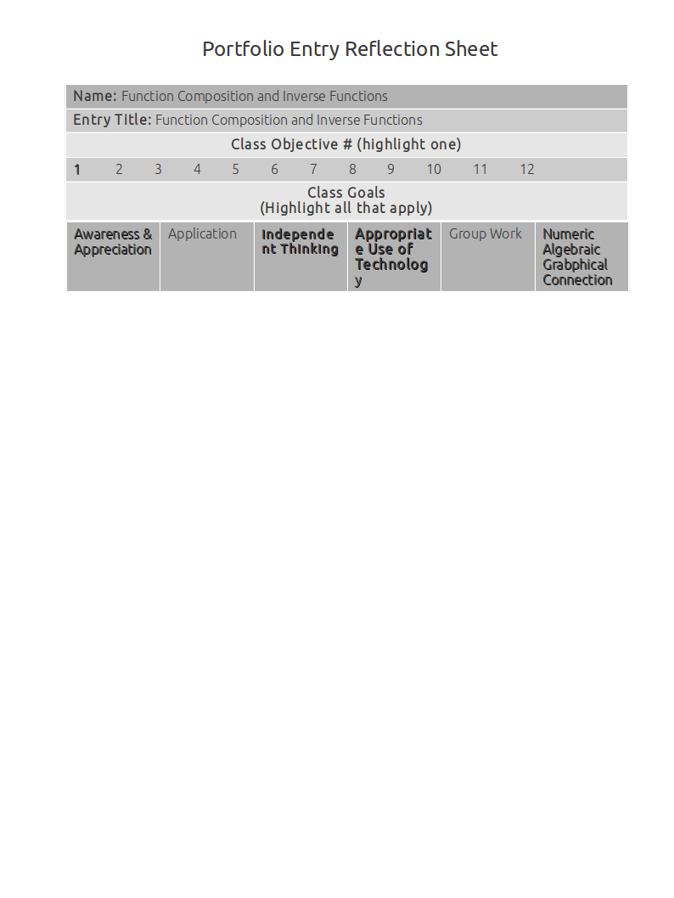

Function Composition And Inverse Functions
==========================================

Function composition and inherited domain and range
---------------------------------------------------

:math:`f(x) = 2x + 3`

Domain is :math:`(-\infty, +\infty)`

:math:`\lim_{x \to -\infty} = -\infty`

:math:`g(x) = -x^2 + 5`

:math:`\lim_{x \to +\infty} = \infty`

:math:`\lim_{x \to -\infty} = \infty`

**find** :math:`(f \circ g)(x)`:

.. math::

   (f \circ g)(x) = f(g(x))

   f(-x^2 + 5) = 2(-x^2 + 5) + 3

   f(-x^2 + 5) = -2x^2 + 10 + 3

   f(-x^2 + 5) = -2x^2 + 13

Function decomposition
----------------------

If :math:`f(g(x)) = \sqrt{x^2 + 3}`, then find :math:`g(x)` and :math:`f(x)`.

:math:`f(x) = \sqrt{x}` and :math:`g(x) = x^2 + 3`

Parametric functions and how they relate to function composition
----------------------------------------------------------------

Inverse functions and inherited domain and range
------------------------------------------------
