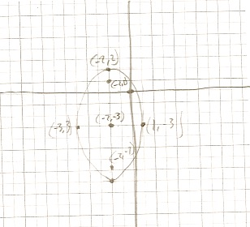

Conic Sections Their Graphs And Applications
============================================

.. image:: reflections/10.png
   :alt: Reflection 10 would go here

.. _model:

How to make conic models that fit given conditions
--------------------------------------------------

**Source**: Notes

**Explanation**: 

This artifact demonstrates how to make conic models that fit given conditions.

I'm assuming that the center of this ellipse is (0, 0).

I know b^2 = 4 because the problem tells us what the minor axis length is.

Since the foci are 6 y-units apart, the point between them would be on y = 3, so c = 3.

Knowing :math:`b^2` and c, I can solve for :math:`a^2` using the pythagorean relation for ellipses :math:`a^2 = b^2 + c^2`

**Artifact**:

Find an equation of the ellipse with foci :math:`(0, \pm3)` whose minor axis has length 4.

.. math::

   b^2 = 4

   c = 3

   a^2 = 4 + 3^2 = 13

   {y^2 \over 13} + {x^2 \over 4} = 1

How to graph conic sections from equations
------------------------------------------

**Source**: Group Quiz 8.2 & 8.3

**Group Work**

This problem was from a group quiz. We initially did this problem independently, but we got different answers, so we worked together to figure out which one was correct.

**Explanation**: 

The first thing I noticed from the equation was that it had addition, so it had to be ellipsoidal.

I noticed that the value with the highest denominator had :math:`y^2` in the numerator, so I knew it was an ellipse opening vertically.

This also told me that :math:`a^2 = 25 \text{ , } b^2 = 9`, and that I could rely on the formula :math:`{(y-k)^2 \over a^2} + {(x-h)^2 \over b^2} = 1`.

I knew the center was :math:`(-2 ,-5)` by comparing equation with the formula.

I knew that the pythagorean relation for an ellipsoid is :math:`c^2 = a^2 - b^2`, so I used my a and b values solve for the distance from the center to the foci (4)

I knew my foci had to be at :math:`(h, k\pm c) = (-2, -3\pm 4)`.

I also knew that my end point had to be at :math:`(h\pm b, k) = (-2\pm 3, -3)` because :math:`b = \sqrt{b^2} = \sqrt{9} = 3`.

From there, all I had to do was graph.

**Artifact**:

Graph :math:`{(x + 2 )^2 \over 9} + {(y + 3)^2 \over 25} = 1`

The applications of conic sections
----------------------------------

**Source**: Section 8.1 Example 6/my own little twist

**Explanation**: 

This artifact demonstrates the applications of conic sections.

This artifact demonstrates how to graph conic sections from equations.

To solve this problem, I went off the assumption that the vertex of the parabolic reflector was at (0,0).

This assumption allowed me to use the formula :math:`x^2 = 4py`

Since the vertex was at (0,0), the distance accross the reflector (6 feet) must divided symmetrically by the y-axis.

Since parabolas are always perfectly symmetric, the distance from the center to the endpoints of the parabolic reflector must be :math:`1 \over 2` of the distance of the width of the parabolic reflector.

I also knew from the problem that the vertical distance from the center is 2.

Knowing these things, I was able to deduce that the endpoints of the parabolic reflector had to be at :math:`(\pm3,2)`.

With that coordinate, all I had to do was plug into the parabolic formula, and solve for p (because p is the distance from the center to the foci).

**Artifact**:

At his weekend job as a secret agent in the CIA, Luis uses a parabolic reflector that he wears on his head with a microphone at the reflector's focus to capture the conversations of russian spies.

If the parabolic reflector is 6 feet across and 2 feet deep, where should the microphone be placed?

Center = :math:`(0, 0)`

.. math::

   (\pm3)^2 = 4p(2)

   p = {9 \over 8}

The microphone should be placed :math:`\approx 1.125` feet from the vertex of the parabolic reflector.
 
How to algebraically manipulate conic equations into standard form
------------------------------------------------------------------

**Source**: Group Quiz 8.2 & 8.3

**Group Work**

This problem was from a group quiz. The three of us worked on this problem together.

**Explanation**: 

This artifact demonstrates how to algebraically manipulate conic equations into standard form.

The first thing I did was organizational. I put the x values next to the other x values and the y values next to the other y values.

Then I pulled a common factor from the x's (25) and a common factor from the y's (16).

The result of this was two quadratic equations which I then factored using completing the square.

Once I had completed the square, I divided both sides by 400 to make the equation equal to 1 (because I knew it is a conic).

Then I divided the remaining common factors (25 and 16) by both sides to complete the hyperbolic equation.

**Artifact**:

Use completing the square and find the equation for :math:`25y^2 - 16x^2 - 100y - 224x - 1084 = 0`

.. math::

   25y^2 - 100y - 16x - 224x = 1084

   25(y^2 - 4y + 4) - 15(x^2 + 14x + 49) = 1084 + 100 - 784

   25(y - 2)^2 - 16(x + 7)^2 = 400

   {25(y - 2)^2 \over 400} - {16(x + 7)^2 \over 400} = {400 \over 400}

   {(y-2)^2 \over 16} - {(x+7)^2 \over 25} = 1

Parabolas, ellipses and hyperbolas
----------------------------------

**Source**: Group Quiz 8.2 & 8.3

**Explanation**: 

This artifact demonstrates parabolas, ellipses and hyperbolas.

The transverse axis is :math:`2a \text{, so } 2a = 6`.

The distance between the center and the foci (c) is the same as the distance between the two foci (in the x) divided by 2, which is 4.

I used the pythagorean relation for a hyperbola, which is :math:`a^2 + b^2 = c^2`, to solve for :math:`b^2`.

I took half the distance between the two foci to get the x value of my center (-1).

I knew the y value of my center was 4, because the center is on the same level as the two given foci.

Now I could just plug into the hyperbolic formula to get the standard form of this hyperbola.

:math:`{(x-h)^2 \over a^2} - {(y-k)^2 \over b^2} = 1`

**Artifact**:

Find the equation for a hyperbola with foci at :math:`(3, 4)` and at :math:`(-5, 4)` and a transverse axis length of 6.

.. math::

   2a = 6\\a = 3

   c = 4

   3^2 + b^2 = 4^2

   b^2 = 7

   {(x+1)^2 \over 9} - {(y-4)^2 \over 7} = 1

