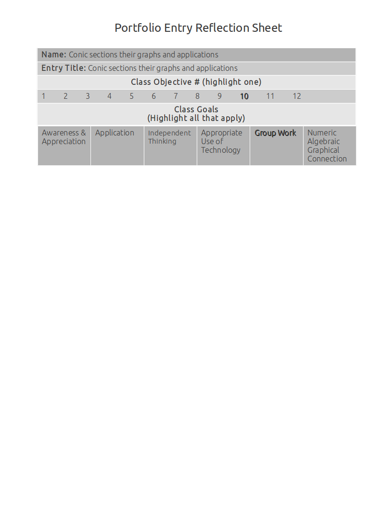

Conic Sections Their Graphs And Applications
============================================

How to make conic models that fit given conditions
--------------------------------------------------

**Source**: Where did this come from?

**Explanation**: How does this artifact meet the objectives and goals?

How to graph conic sections from equations
------------------------------------------

**Source**: Where did this come from?

**Explanation**: How does this artifact meet the objectives and goals?

The applications of conic sections
----------------------------------

**Source**: Where did this come from?

**Explanation**: How does this artifact meet the objectives and goals?

How to algebraically manipulate conic equations into standard form
------------------------------------------------------------------

**Source**: Where did this come from?

**Explanation**: How does this artifact meet the objectives and goals?

Parabolas, ellipses and hyperbolas
----------------------------------

**Source**: Where did this come from?

**Explanation**: How does this artifact meet the objectives and goals?
