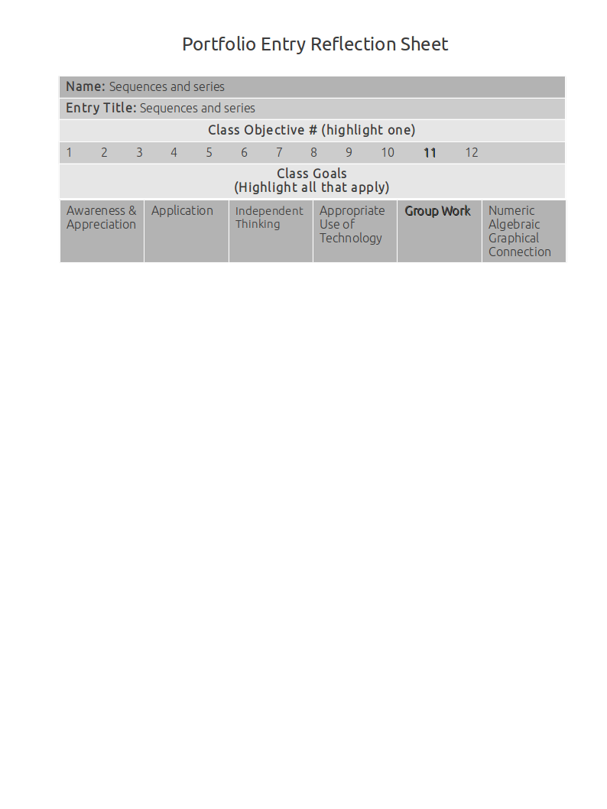

Sequences And Series
====================

Geometric and arithmetic sequences
----------------------------------

**Source**: Made them up.

**Explanation**: 

This artifact demonstrates the usage of both geometric and arithmetic sequences.

The first example is geometric, and the second is arithmetic.

**Artifact**:

#. Find the first 3 terms and the 50th term of the sequence :math:`\{a_k\}` in which :math:`a_k = k^2-k`.

.. math::

   a_1 = 1^2 - 1 = 0

   a_2 = 2^2 - 2 = 2

   a_3 = 3^2 - 3 = 6

   a_50 = 50^2 - 50 = 2450

#. Find the first 3 terms and the 100th term of the sequence :math:`\{a_k\}` in which :math:`a_k = k + 4`.

.. math::

   a_1 = 1 + 4 = 5

   a_2 = 2 + 4 = 6

   a_3 = 3 + 4 = 7

   a_100 = 100 +4 = 104

Defining sequences explicitly and recursively
---------------------------------------------

**Source**: Group Quiz 9.4 & 9.5

**Explanation**: 

This artifact demonstrates defining sequences explicitly and recursively.

The recursive formula works by multiplying the previous number in the series by 3, starting with -2.

The explicit formula works by using indices (n) starting at 1.

The exponent on the formula is n-1. Since the first index is 1, the -3 will be nulled because anything to the 0 power is 1.

The explicit formula is a bit nicer for humans because you don't have to calculate the values recursively.

**Artifact**:

Find the **explicit** and **recursive** formulas that model -2, 6, -18, 54, -162...

Recursive:

.. math:: A_1 = -2\\A_n = A_{n-1} * 3

Explicit:

.. math:: A_n = -2(-3)^{n-1}

Summations notation
-------------------

**Source**: Notes June 06, 2012

**Explanation**: 

This artifact demonstrates summations notation.

The slope of the explicit function is 7 because that is the rate of change in the series that is suggested by the data.

I plugged in (1, 2) because 2 is the first item in the series (1 is the first index value).

I set it equal to the last term of the series to solve for the last index number, because that goes ontop of the sigma.

I used the gaussian method to find the sum of the finite arithmetic series. 

**Artifact**:

Express the [2, 9, 16, 23, ..., 107] in summation notation.

.. math::

   y = mx + b

   y = 7x + b

   2 = 7(1) + b

   b = -5

   y = 7x -5

   107 = 7x - 5

   x = 16

   ({(2 + 107) \over 2}) * 16 = 872

   \displaystyle\sum_{x=1}^{16} {7x-5} = 872

Summing finite arithmetic and geometric sequences
-------------------------------------------------

**Source**: Section 9.5 Example 2 and Group Quiz 9.4 & 9.5

**Explanation**: 

This artifact demonstrates summing finite arithmetic and geometric sequences.

1)

I used the formula :math:`a_1(1 - r^n) \over 1 -r` to find the sum of this geometric series.

I was given :math:`a_1 \text{ and } a_n`. I just needed to find the :math:`r` value by using basic algebra.

2)

I found the average of the first and last values in the series and then multiplied that by the number of values in the sequence to get the sum.

**Artifact**:

1) Find the sum of the geometric series :math:`4, -{4 \over 3}, {4 \over 9}, -{4 \over 27}, ... , 4(-{1 \over 3})^{10}`

.. math::

   A_1 = 4

   4r = -{4 \over 3}

   r = -{1 \over 3}

   A_n = 4(-{1 \over 3})^{10}

   n = 11

   {4(1 + {1 \over 3}^{11}) \over 1 + {1 \over 3}} \approx 3.000016935

2) Find the sum of the arithmetic series :math:`\displaystyle\sum_{k=1}^{4} {-6 + k}`.

.. math::

   A_1 = -6 + 1 = -5

   A_4 = -6 + 4 = -2

   ({(-5 +(-2)) \over 2}) * 4 = -14

Summing infinite geometric sequences
-------------------------------------

**Source**: Notes

**Explanation**: 

This artifact demonstrates summing infinite geometric  sequences.

To find the sum, I used the formula for the sum of an infinite geometric series (:math:`A_1 \over 1 - r`).

This formula only works for geometric series that converge (eventually reaches a limit, usually 0).

**Artifact**:

Find the sum of the infinite geometric sequence [32, 16, 8, 4, 2, 1...]:

.. math::

   \text{sum } = {32 \over 1 - {1 \over 2}} = 64

   \displaystyle\sum_{k=1}^{\infty} {32({1 \over 2})^{k-1}} = 64
