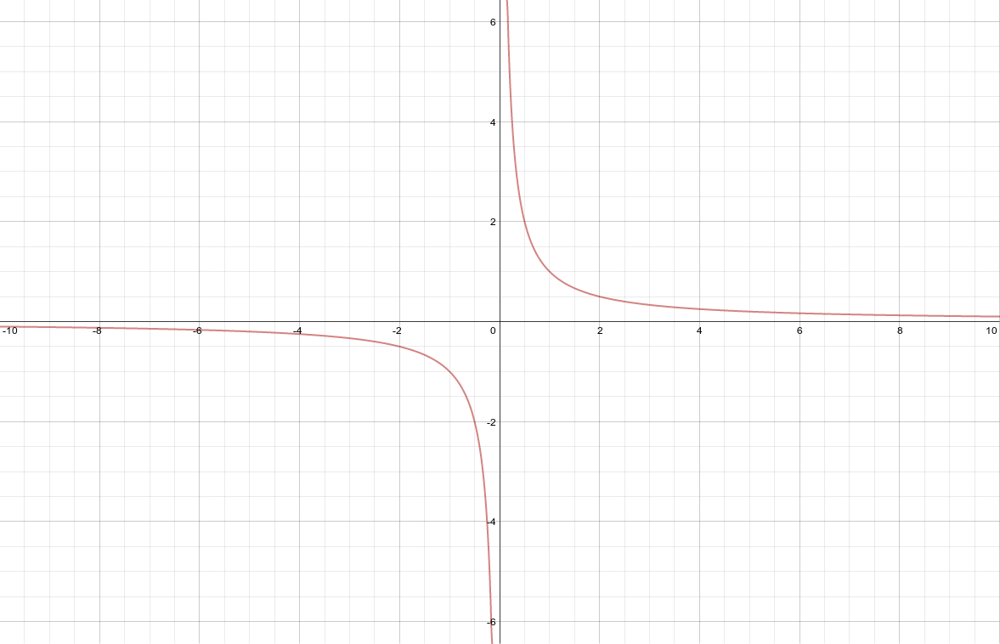

Limits
======

.. image:: reflections/12.png
   :alt: Reflection 12 would go here

How to write asymptotes in limit notation
-----------------------------------------

**Source**: 

**Explanation**: 

This artifact demonstrates how to write asymptotes in limit notation.

Example 1)

As x becomes extremely large, the value of f(x) approaches 2, and the value of f(x) can be made as close to 2 as one could wish just by picking x sufficiently large.

The limit of f(x) as x approaches infinity is 2.

Example 2)

As x approaches 0, :math:`f(x)` approaches positive or negative infinity, depending on which direction x is approaching from.
This is because the closer the number gets to 0, the smaller it has got to be. For x-values like 0.0001, :math:`f(x)` will actually be a big number because :math:`f(x) = {1 \over x}`

Inversely, as x approaches positive or negative 0, :math:`f(x)` approaches 0 because :math:`f(x)` is always a fraction.
As the demominator of the fraction increases, it's value decreases and is getting closer and closer to 0.

**Artifact**:

Example 1)

:math:`f(x) = {2x - 1 \over x}\\
\lim_{x \to \infty} {2x - 1 \over x} = 2`

Example 2)

:math:`f(x) = {1 \over x}\\
\lim_{x \to 0} {1 \over x} = \pm \infty\\
\lim_{x \to \pm \infty} {1 \over x} = 0`

Removable discontinuity
-----------------------

**Source**: Online Tutorial

**Awareness and Appreciation**:

I didn't know how to do this, but Igoogled it succesfully.

This demonstrates that I am aware of the magnificient resources that are available to me, and that I appreciate them because I use them.

**Independent Thinking**

I didn't know what to show about removable discontinuity, I just knew what it was.

So I went online and read about it to figure out how it works.

**Explanation**: 

This artifact demonstrates removable discontinuity.

Discontinuity is removable if you can easily
plug in the holes in its graph by redefining the
function.

In the original function, for -2 and 2 f(x) is undefined. But a little bit of algebraic magic reveals that the function can be "patched" for f(2) to be successful.

**Artifact**:

.. math::

   f(x) = {x-2 \over x^2 - 4}

   {x - 2 \over (x-2) (x+2)}

   {1 \over x+2} \text{ The (x-2)s cancel out}

   f(2) = {1 \over 4}

   f(x) = {1 \over 4} \text{ if x = 2}

   x = -2 \text{ Vertical Asymptote}

   x = 2 \text{ Removable Discontinuity}

