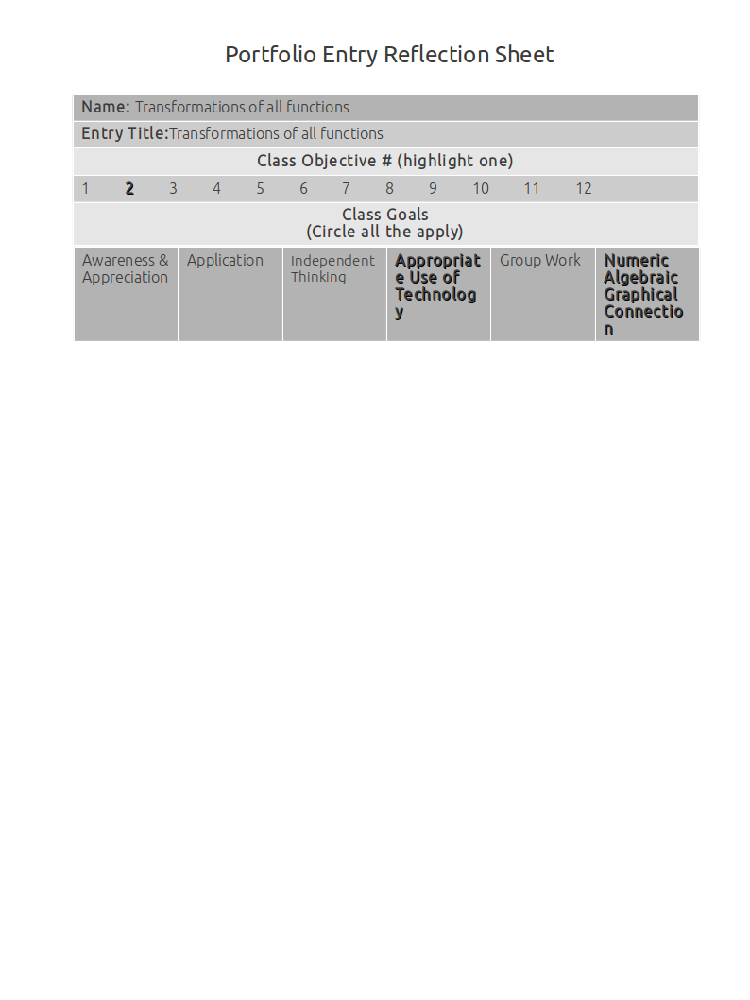
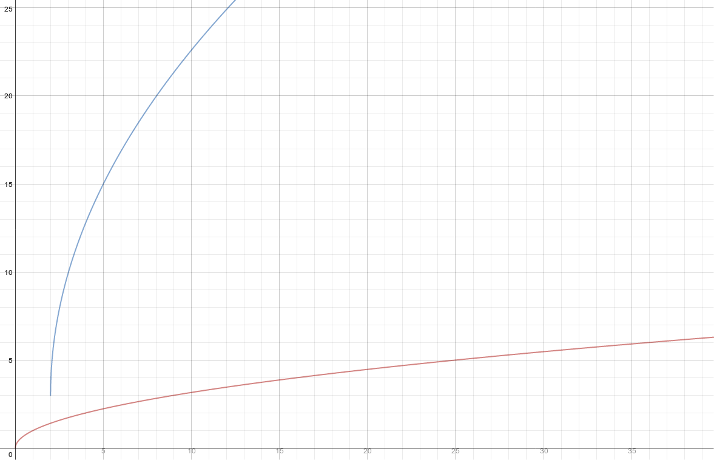

Transformations Of All Functions
================================

Graphical transformations by comparing two functions and listing the graphical transformations
----------------------------------------------------------------------------------------------

**Source**: A problem from my notes

**Explanation**: 

In this artifact, I compare f(x) and g(x), and then list the graphical transformations required to get from f(x) to g(x).

I got the solution by referencing the formula: :math:`a*f(b(x-c))+d`

:math:`g(x)` fits the formula like so: :math:`3 * f(1(x-1)) + 2`

**Artifact**:

Describe how the graph of :math:`f(x) = \sqrt{x}` can be transformed into :math:`g(x) = 3 * \sqrt{(x - 1)} + 2`

#. Horizontal shift of f(x) by **one** unit beacuse c shifts the graph horizontally by d units.
#. Vertical shift of f(x) by **two** units because d shifts the graph vertically by d units.
#. Vertical stretch by magnitude of **three** because :math:`a > 1`

Graphical transformations by rewriting a function from a list of transformations
--------------------------------------------------------------------------------

**Source**: From my notes

**Explanation**: 

This artifact demonstrates graphical transformations by rewriting a function from a list of transformations.

Like the previous proficiency, I got the solution by referencing the formula: :math:`a*f(b(x-c))+d`

Here are the steps I took to get from :math:`\sqrt{x}` to :math:`-4 * \sqrt{3(x-2)} + 5`, in order.

#. :math:`-\sqrt{x}`
#. :math:`-4\sqrt{x}`
#. :math:`-4\sqrt{3x}`
#. :math:`-4\sqrt{3(x-2)}`
#. :math:`-4\sqrt{3(x-2)+5}`

**Artifact**:

Transform :math:`f(x) = \sqrt{x}` into :math:`g(x)`

#. Reflect over the x-axis
#. Vertical stretch by a magnitude of **four**
#. Horizontal shrink by a magnitude of :math:`{1 \over 3}`
#. Horizontal shift by **two** units.
#. Vertical shift by **five** units.

.. math::

   g(x) = -4 * \sqrt{3(x-2)} + 5

Graphical transformations by transforming a graph given transformations
-----------------------------------------------------------------------

**Source**: Made it up

**Explanation**: 

This artifact demonstrates graphical transformations by transforming a graph given transformations.

Like the previous proficiencies, I got the solution by referencing the formula: :math:`a*f(b(x-c))+d` 

Here are the steps I took to get from :math:`f(x) = \sqrt{x}` to :math:`g(x)`.

#. :math:`4\sqrt{x}`
#. :math:`4\sqrt{3x}`
#. :math:`4\sqrt{3(x-2)}`
#. :math:`4\sqrt{3(x-2)+3}`

**Numeric Algebraic Graphic Connection**

I've included a graph of the functions described in this artifact. This graph backs up my claims. It is the visual/numerical representation of my algebraic formulas.

**Appropriate Use of Technology**

I used an online graphing calculator to generate the graph below.

Once I generated it:

* I took a screenshot of the online graph
* I cropped the screenshot
* I added the image to my local code repository
* I included the image in my source code
* I uploaded the image to my code repository (https://github.com/doubledubba/precalc) and updated my code
* I synchronized my readthedocs.org project with my repo

**Artifact**:

Transform :math:`f(x) = \sqrt{x}` into :math:`g(x)` with the following transformations:

#. Vertical stretch by magnitude of **four**
#. Horizontal shrink by magnitude of :math:`{1 \over 3}`
#. Horizontal shift of **two** units
#. Vertical shift of **three** units.

:math:`f(x) = \sqrt{x}` (red)

:math:`g(x) = 4\sqrt{3(x-2)}+3` (blue)

All graphical transformations by using each type of transformation
------------------------------------------------------------------

**Source**: I made it up.

**Explanation**: 

This artifact demonstrates all graphical transformations by using each type of transformation.

It shows proficiency in:

* Reflection
* Translation
* Stretches and shrinks

**Artifact**:

Transform :math:`f(x) = |x|` into :math:`g(x) = -3|4(x+4)|-7`

#. Reflect over x-axis
#. Vertical stretch by magnitude of 3
#. Horizontal shrink by magnitude of :math:`{1 \over 4}`
#. Horizontal shift by **-4** units.
#. Vertical shift by **-7** units.

