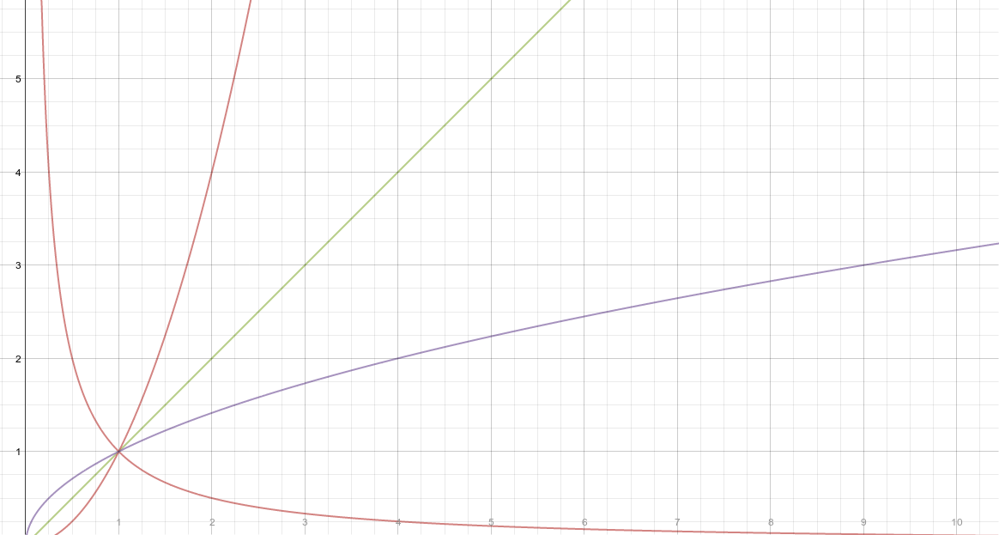
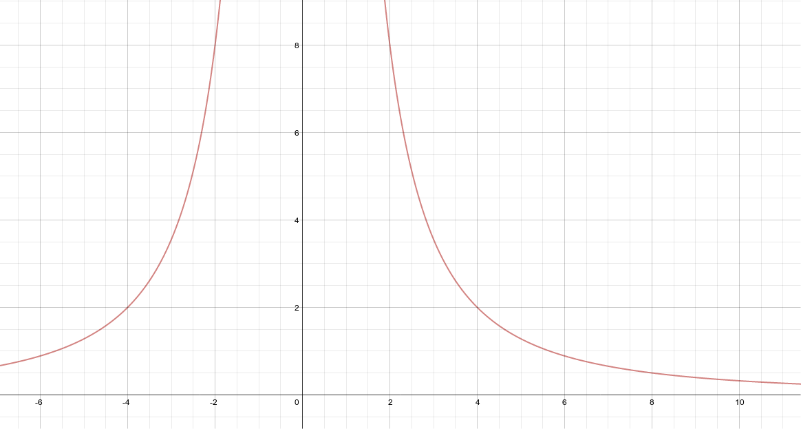

Power Functions, Their Graphs And Applications
==============================================

.. image:: reflections/3.png
   :alt: Reflection 3 would go here

Graphs of different power functions
-----------------------------------

**Source**: 

**Explanation**: 

This artifact demonstrates graphs of different power functions.

**Orange**: :math:`a < 0` 

**Red**: :math:`a > 0`

**Green**: :math:`a = 1`

**Purple**: :math:`0 < a < 1`

**Artifact**:

Writing a power function from a list of data
--------------------------------------------

**Source**: Chapter 2 Test Non Calculator #1

**Explanation**: 

This artifact demonstrates writing a power function from a list of data.

**Artifact**:

=====  =====
x      y    
=====  =====
1      32
2      8
6      8/9
8      0.5
20     0.32
=====  =====

:math:`2^n = {1 \over 4}\\
n = -2\\
8 = a2^{-2}\\
a = 32\\
y = 32x^{-2}`

Testing it out in python::

    points = (  # dataset
        (1.0, 32.0),
        (2.0, 8.0),
        (6.0, 8.0/9.0),
        (8.0, 0.5),
        (10.0, 0.32),
    )

    def f(x):  # This is a function. A x value gets plugged in, and a y value comes out.
        return 32.0*x**-2  # same as 32*x^-2

    for x,y in points:  # This is a recursive loop. x and y are variables points from our dataset
        assert y == f(x)  # If y is not equal to f(x), then the program will fail.

Applications of power functions through direct or indirect variation
--------------------------------------------------------------------

**Source**: Chapter 2 Test (calculator portion) #2

**Explanation**: 

This artifact demonstrates applications of power functions through direct or indirect variation.

**Artifact**:

The top speed at which a person can sprint varies *directly* as the *square* of their stride length.

If a person can run at a top speed of 14 mph with a stride length of 0.6m,

how fast can she run if she increases her stride length to 0.65 meters?

:math:`s(l) = a*l^2\\
14 = a*0.6^2\\
a = 38.89\\
s(l) = 39.89l^2\\
s(0.6) = 13.969 \text{ mph}\\
s(0.65) = 16.393 \text{ mph}`
