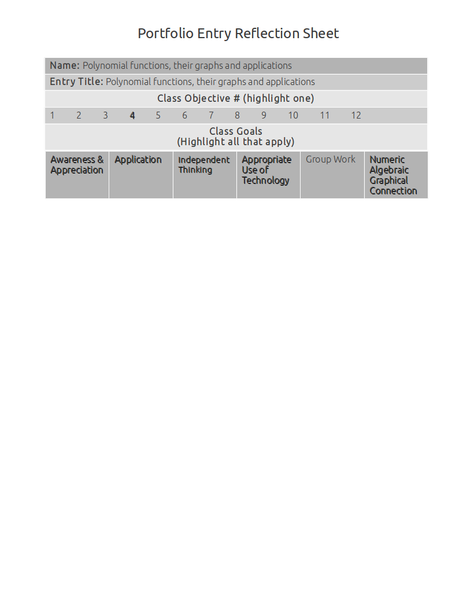
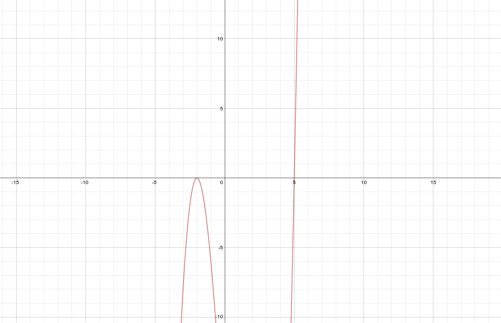

Polynomial Functions, Their Graphs And Applications
===================================================

Graphs of polynomial functions by graphing a polynomial that shows comprehension of how multiplicity and end behavior affect the graph
--------------------------------------------------------------------------------------------------------------------------------------

**Source**: Found an online tutorial about multiplicity, I got the function below from there.

**Explanation**: 

This artifact demonstrates graphs of polynomial functions by graphing a polynomial that shows comprehension of how multiplicity and end behavior affect the graph.

The graph below has two zeros (5 and -2) and a multiplicity of 3.

While the zeroes overlap and stay the same, changing the exponents of these linear factors changes the end behavior of the graph.

The exponents currently add up to 3 (multiplicity), which is an odd number.

Because the multiplicity is odd, the graph looks the way it does.
If you were to change the multiplicity to any odd number, the graph would have the same end behavior and look essentially the same.

If the multiplicity were even, the end behavior would be different (parabolic).

**Artifact**:

Graph of :math:`(x-5)(x+2)^2`

Factoring a higher degree polynomial with and without complex zeros
-------------------------------------------------------------------

**Source**: Notes

**Explanation**: 

This artifact demonstrates factoring a higher degree polynomial with and without complex zeros.

**Artifact**:

Reduce :math:`x^4 - 3x^3 - 6x^2 + 6x + 8`

Synthetic division (divided by -1)

==== === ==== === ===
1    -3  -6   6   8
==== === ==== === === 
0    -1  4    2   -8
1    -4  -2   8   0
==== === ==== === ===

:math:`(x+1)(x^3-4x^2-2x+8)`

Synthetic Division (divided by 4)

==== === ==== ===
1    -4  -2   8  
==== === ==== ===
0    4   0    -8
1    0   -2   0
==== === ==== ===

:math:`(x+1)(x-4)(x^2-2)`

:math:`(x+1)(x-4)(x-\sqrt{2})(x+\sqrt{2})`

Factoring a higher degree polynomial that has a leading coefficient that is not one
-----------------------------------------------------------------------------------

**Source**: Notes

**Explanation**: 

This artifact demonstrates factoring a higher degree polynomial that has a leading coefficiant that is not one.

**Artifact**:

Reduce :math:`3x^4 + 8x^3 + 6x^2 + 3x - 2` to linear factors.

Synthetic Division (divided by -2)

==== ==== ==== ==== ====
3    8    6    3    -2
==== ==== ==== ==== ====
0    -6   -4   -4   2
3    2    2    -1   0
==== ==== ==== ==== ====

:math:`(x + 2) (3x^3 + 2x^2 + 2x -1)`

Synthetic Division (divided by :math:`1 \over 3`)

==== ==== ==== ====
3    2    2    -1  
==== ==== ==== ====
0    1    1    1
3    3    3    0
==== ==== ==== ====

:math:`(x + 2) (x - {1 \over 3}) (3x^2 + 3x + 3)`

:math:`(x + 2) (x - {1 \over 3}) 3(x^2 + x + 1)`

:math:`(x + 2) (3x - 1) (x^2 + x + 1)`

:math:`\text{from }(x^2 + x + 1) \text{ x =  } {-1 \over 2} \pm {i\sqrt{3} \over 2}`

:math:`(x + 2) (3x - 1) (x - ({-1 \over 2} - {i\sqrt{3} \over 2})) (x - ({-1 \over 2} + {i\sqrt{3} \over 2}))`

:math:`(x + 2) (3x - 1) (x + {1 \over 2} - {i\sqrt{3} \over 2}) (x + {1 \over 2} + {i\sqrt{3} \over 2})`

:math:`{1 \over 2} (x + 2) {1 \over 2} (3x - 1) 2 (x + {1 \over 2} - {i\sqrt{3} \over 2}) 2 (x + {1 \over 2} + {i\sqrt{3} \over 2})`

:math:`{1 \over 2} (x + 2) {1 \over 2} (3x - 1) (2x + 1 - i\sqrt{3}) (2x + 1 + i\sqrt{3})`

Solving polynomial equations and inequalities
---------------------------------------------

**Source**: 

**Explanation**: 

This artifact demonstrates solving polynomial equations and inequalities.

**Artifact**:

Applications of polynomial functions
------------------------------------

**Source**: 

**Explanation**: 

This artifact demonstrates applications of polynomial functions.

**Artifact**:

