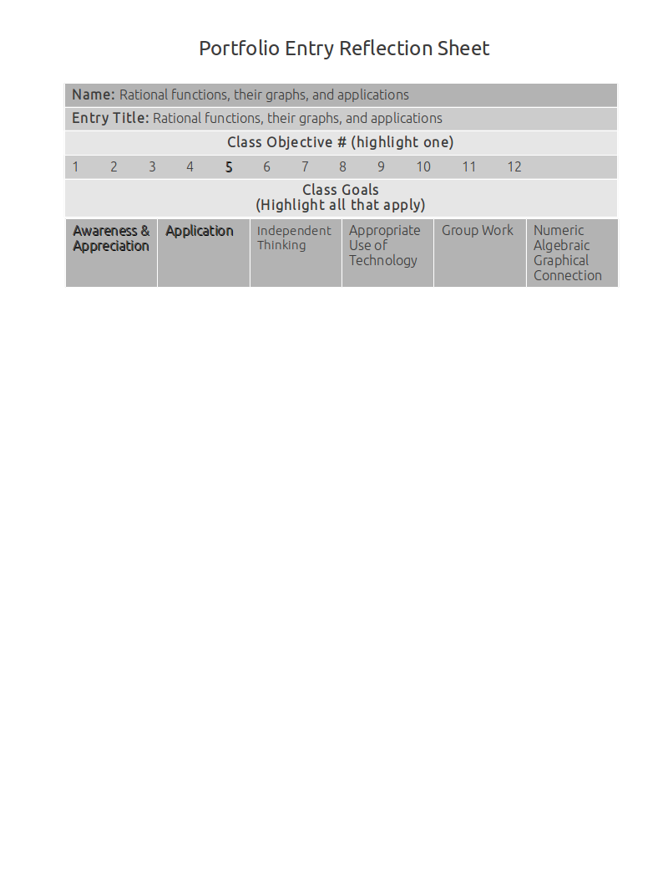
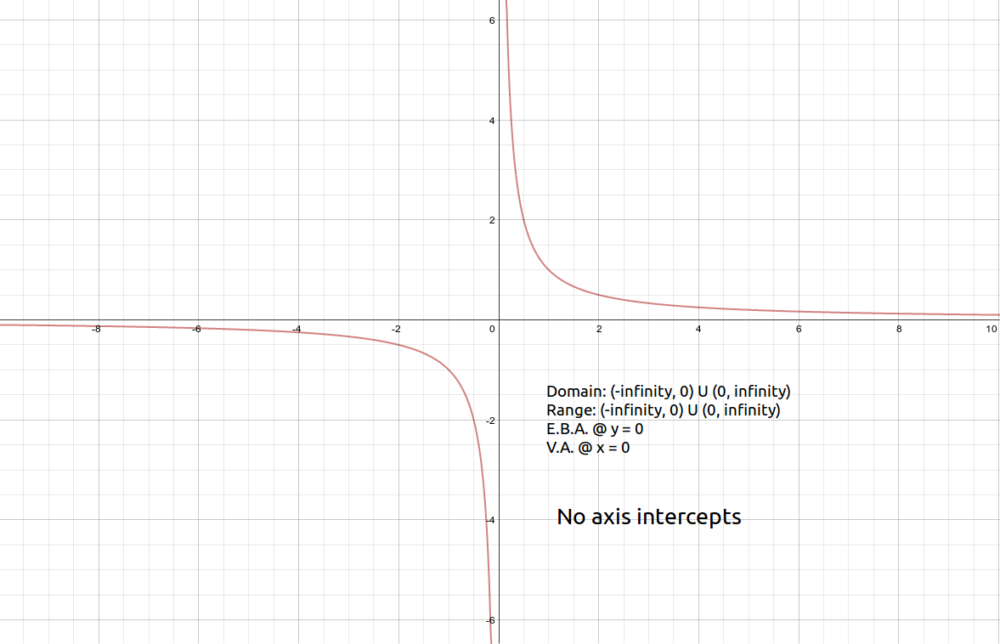

Rational Functions, Their Graphs, And Applications
==================================================

Graphs of rational functions including all intercepts and asymptotes
--------------------------------------------------------------------

**Source**: 

**Explanation**: 

This artifact demonstrates graphs of rational functions including all intercepts and asymptotes.

**Artifact**:

:math:`\text{Graph of }f(x) = {1 \over x}`

Algebraic manipulation of rational functions
--------------------------------------------

**Source**: 

**Explanation**: 

This artifact demonstrates algebraic manipulation of rational functions.

**Artifact**:

Utilizing rational functions through applications
-------------------------------------------------

**Source**: 

**Explanation**: 

This artifact demonstrates utilizing rational functions through applications.

**Artifact**:

Solving rational functions inequalities
---------------------------------------

**Source**: 

**Explanation**: 

This artifact demonstrates solving rational functions inequalities.

**Artifact**:

