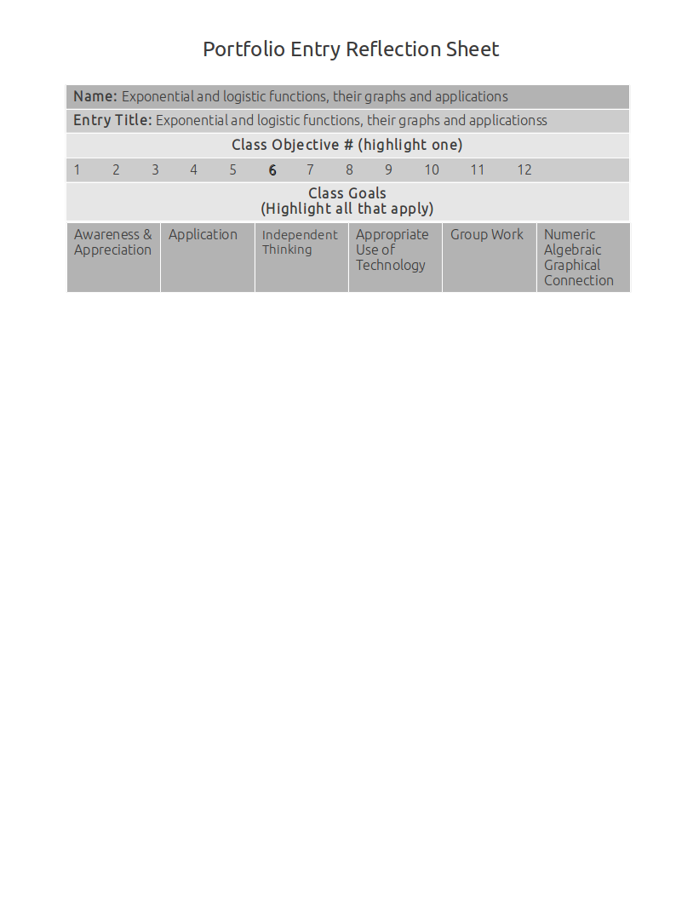

Exponential And Logistic Functions, Their Graphs And Applications
=================================================================

Writing exponential models
--------------------------

**Source**: Where did this come from?

**Explanation**: How does this artifact meet the objectives and goals?

This artifact demonstrates writing exponential models

**Artifact**:

Writing logistic models
-----------------------

**Source**: Where did this come from?

**Explanation**: How does this artifact meet the objectives and goals?

This artifact demonstrates writing logistic models

**Artifact**:

Graphing exponential functions
------------------------------

**Source**: Where did this come from?

**Explanation**: How does this artifact meet the objectives and goals?

This artifact demonstrates graphing exponential functions

**Artifact**:

Applying exponential models
---------------------------

**Source**: Where did this come from?

**Explanation**: How does this artifact meet the objectives and goals?

This artifact demonstrates applying exponential models

**Artifact**:

Applying logistic models
------------------------

**Source**: Where did this come from?

**Explanation**: How does this artifact meet the objectives and goals?

This artifact demonstrates applying logistic models

**Artifact**:

