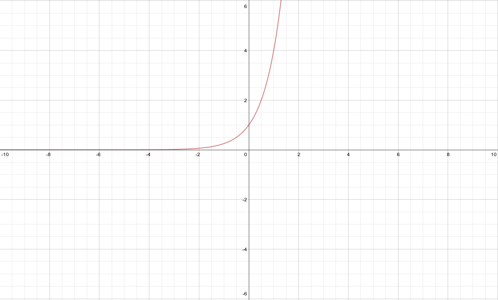

Exponential And Logistic Functions, Their Graphs And Applications
=================================================================

.. image:: reflections/6.png
   :alt: Reflection 6 would go here

Writing exponential models
--------------------------

**Source**: Made it up.

**Explanation**: 

This artifact demonstrates writing exponential models.

I used the exponential formula :math:`y = ab^x` to solve this problem.

:math:`a` stands for the initial amount.

:math:`b` stands for the rate.

Since the rate is a percentage that is growing, I need to express it as 1 + 0.031, or else my function would be decaying and inaccurate.

**Artifact**:

My height is growing exponential by 3.1% every year. Right now he I am 68.4 inches tall.

An exponential model for my height would be

.. math::

   y = 68.4(1 + 0.031)^{1 \over 3}

   y = 68.4(1.031)^{x \over 3} \text{ x is in years.}

Writing logistic models
-----------------------

**Source**: Chapter 3 Test Non Calculator Section #3

**Explanation**: 

This artifact demonstrates writing logistic models.

This problem makes use of the logistic formula: :math:`y = {c \over 1 + ab^x}`.

I only get the limit, the initial value, and a point - I need to solve for a so I can solve for b.

I get started by filling in what I know (the limit growth and the given x,y point).

Then I solve for a, which I plug back into the formula so I can solve for b.

Once I've got b, I can drop the x,y coordinate that I was using before so I can re-use my function with different variables.

**Artifact**:

Find the logistic function that has a limit to growth of 24, and initial value of 6, and goes through the point :math:`(8, 14)`.

.. math::

   6 = {24 \over a + ab^x}\\
   6 = {24 \over 1 + a(1)}\\
   6 + 6a = 24\\
   6a = 18\\
   a = 3\\
   14 = {24 \over 1 + 3(b)^8}\\
   14(1 + 3b^8) = 24\\
   14 + 42b^8 = 24\\

   42b^8 = 10\\
   b^8 = {10 \over 42} = {5 \over 21}\\
   b = {5 \over 21}^{1 \over 8}\\
  y = {24 \over 1 + 3({5 \over 21})^{x \over 8}}

Graphing exponential functions
------------------------------

**Source**: 

**Explanation**: 

This artifact demonstrates graphing exponential functions.

All this problem had me do was create an x,y table for evaluating f(x) with different x values.

Then I could plot the points on the line and graph the function accurately based on my knowledge of that the end behavior of an exponential graph should look like.

**Artifact**:

Graph :math:`f(x) = 4^x`

==== ====
x    y
==== ====
0    1
1    4
2    16
3    64
==== ====

:math:`\lim_{x \to -\infty} = 0`

Applying exponential models
---------------------------

**Source**: Made it up.

**Explanation**: 

This artifact demonstrates applying exponential models.

Since I am currently 17, I plug in 2 for x because that is the difference between 19 and 17.

Then all I have to do is solve the exponential equation to get my answer.

**Artifact**:

Using the previously defined model for my height (:math:`y = 68.4(1.031)^{x \over 3} \text{ x is in years.}`).

I can try and guess what my height will be when I am 19.

.. math::

   y = 68.4(1.031)^{x \over 3}

   y = 68.4(1.031)^{2 \over 3}

   y \approx 69.80639 \text{ inches}

The 3.1% statistic is obviously incorrect, so my answer is a bit skewed.

Applying logistic models
------------------------

**Source**: 

**Explanation**: 

This artifact demonstrates applying logistic models.

The logistic formula is given to me here. All I have to do is solve for the y value of 1 million.

I start by multiplying by :math:`1 + 21.602e^{-0.05054t}` and dividing by 1,000,000 to get the t in an easier postion.

I keep cutting down the side of the equation that has t on it until I've got it ready to use the logarithmic power rule.

Then I just have to some more basic simplification and I'm done!

**Application**:

This is a very real-life application. Every 4 years the government runs a national census.

Individual counties and districts all over the country run censuses too.

Knowing how to use logistic models is crucial, because they are good for population modeling.

This is because they have a limit growth value, which makes them more realistic functions than others that are more unbounded.

**Artifact**:

Based on recent census data, a logistic model for the population of Dallas, *t* years after 1900, is as follows:

:math:`P(t) = {1,301,642 \over 1 + 21.602e^{-0.05054t}}`

According to this model, when was the population 1 million?

.. math::

   {1,301,642 \over 1 + 21.602e^{-0.05054t}} = 1,000,000

   {1,301,642 \over 1,000,000} = 1 + 21.602e^{-0.05054t}

   1.301642 = 1 + 21.602e^{-0.05054t}

   0.301642 = 21.602e^{-0.05054t}

   \log(0.0139636145) = \log(e^{-0.05054t})

   \log(0.0139636145) = \log(e) * -0.05054t

   {\log(0.0139636145) \over \log(e)} = -0.05054t

   -0.8056171977 = -0.05054t

   t \approx 15.9401 \text{ years (1915)}
