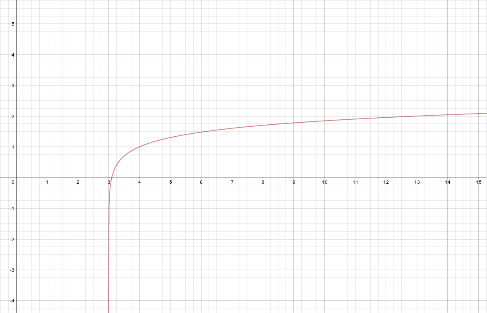

Logarithmic Functions Their Graphs And Applications
===================================================

.. image:: reflections/7.png
   :alt: Reflection 7 would go here

Rewriting exponentials into logarithms and logarithms into exponentials using common log, natural log, and logarithms of other bases
------------------------------------------------------------------------------------------------------------------------------------

**Source**: I made these up.

**Explanation**: 

This artifact demonstrates rewriting exponentials into logarithms and logarithms into exponentials using common log, natural log, and logarithms of other bases.

#. Exponential :math:`\rightarrow` Common Log
#. Commong log :math:`\rightarrow` Exponential
#. Exponential :math:`\rightarrow` Natural Log
#. Natural log :math:`\rightarrow` exponential

**Artifact**:

#. :math:`4^x = 6 \rightarrow log_4 6 = x`
#. :math:`log_2 2 = x \rightarrow 2^x = 2`
#. :math:`e^x = e \rightarrow ln(e)`
#. :math:`ln(8) \rightarrow e^x = 8`

Properties of logarithms
------------------------

**Source**: Notes

**Explanation**: 

This artifact demonstrates properties of logarithms.

1) This problem demonstrates the Product Rule.

:math:`log_b {rs} = log_b r + log_b s`

2) This problem demonstrates the Quotient Rule.

:math:`log_b {r \over s} = log_b r - log_b s`

3) This problem demonstrates the Power Rule.

:math:`log_b {r^c} = log_b r * c`

**Artifact**:

1) :math:`log(x+6) + log(x-2) = 2`

.. math::

   log((x+6)(x-2)) = 2

   log(x^2 + 4x -12) = 2

   10^2 = x^2 + 4x -12

   x^2 + 4x -112 = 0

   x \approx 8.77 \text{ or } x \approx -12.770

2) :math:`log(x+6) - log(x-2) = 2`

.. math::

   log({(x+6) \over (x-2)}) = 2

   10^2 = {(x+6) \over (x-2)}

   x \approx {26 \over 9}

3) :math:`\text{Solve for }log_4 117`

.. math::

   4^x = 117

   log(4^x) = log(117)

   x * log(4) = log(117)

   x = {log(117) \over log(4)} = 3.435

Graphs of logarithms
--------------------

**Source**: Made it up.

**Explanation**: 

This artifact demonstrates graphs of logarithms.

I started with the base function :math:`y = log(x)` and manipulated it into :math:`log(x-3)+1`.

The formula :math:`y = log(x)` is the same as :math:`10^y = x`, which is easier to evaluate (for y).

**Artifact**:

Graph :math:`log(x-3)+1`

==== ====
x    y   
==== ====
0.01 -2
0.1  -1
1    0
10   1
==== ====

==== ====
x+3  y+1
==== ====
3.01 -1
3.1  0
4    1
13   2
==== ====

Applications of logarithms
--------------------------

**Source**: #53 from Section 3.4

**Explanation**: 

This artifact demonstrates applications of logarithms.

In the first step I demonstrate that I know how to re-write common logs into exponential form.

After that, I can plug in the given x value (40 ft) and the equation becomes linear and easy to solve.

**Awareness and Appreciation**:

In this artifact I demonstrate that I am aware that I am error-prone even if the problem is easy,
and that I can appreciate double-checking my answers.

**Artifact**:

The relationship between intensity *I* of light (in lumens) at a depth of x feet in Lake Superior is given by :math:`log({I \over 12}) = -0.00235x`

What is the intensity at a depth of 40 ft?

.. math::

   10^{-0.00235x} = {I \over 12}

   0.805358 = {I \over 12}

   I = 9.664541294 \text{ lumens}

   \text{Checking my work...}\\

   log({9.664541294 \over 12}) = -0.94

   -0.00235 * 40 = -0.94
