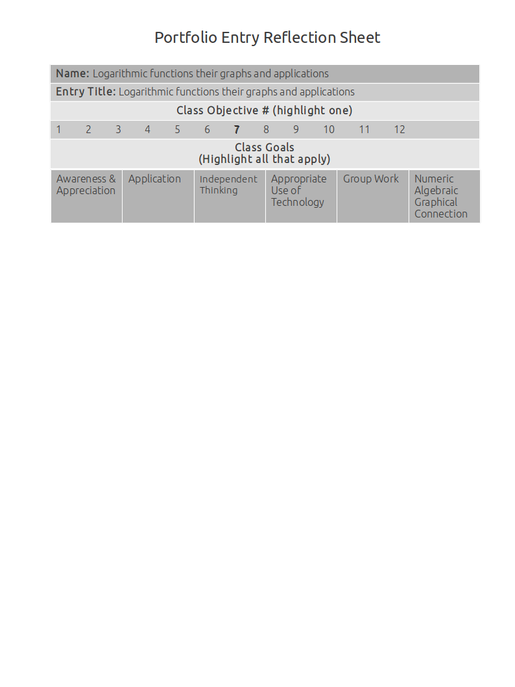

Logarithmic Functions Their Graphs And Applications
===================================================

Rewriting exponentials into logarithms and logarithms into exponentials using common log, natural log, and logarithms of other bases
------------------------------------------------------------------------------------------------------------------------------------

**Source**: 

**Explanation**: 

This artifact demonstrates rewriting exponentials into logarithms and logarithms into exponentials using common log, natural log, and logarithms of other bases.

**Artifact**:

Properties of logarithms
------------------------

**Source**: 

**Explanation**: 

This artifact demonstrates properties of logarithms.

**Artifact**:

Graphs of logarithms
--------------------

**Source**: 

**Explanation**: 

This artifact demonstrates graphs of logarithms.

**Artifact**:

Applications of logarithms
--------------------------

**Source**: 

**Explanation**: 

This artifact demonstrates applications of logarithms.

**Artifact**:

