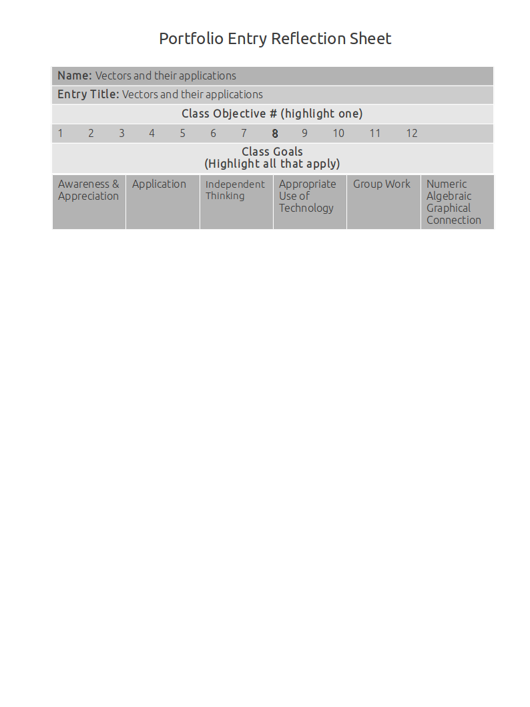

Vectors And Their Applications
==============================

Different forms of vectors
--------------------------

**Source**: Section 1.6 Example 2

**Explanation**: 

This artifact demonstrates the different forms of vectors.

In the problem, the vector is in coordinate form.

I convert it to component form using the Head Minus Tail Rule, and then I convert it to magnitude form by taking its' magnitude.

**Artifact**:

Find the magnitude of the vector :math:`v` represented by :math:`\overrightarrow{PQ}` where P = (-3, 4) and Q = (-5, 2)

:math:`(2-4, -5-(-3)) = (-2, -2) \text{ Using the Head Minus Tail Rule}\\
|v| = \sqrt{(-2)^2 + (-2)^2} = 2\sqrt{2} \text { Component form to magnitude}`
    
Vector application
------------------

**Source**: #2 from quiz 6.1 & 6.2

**Explanation**: 

This artifact demonstrates vector application.

**Artifact**:

A boat is on a bearing of :math:`210^\circ` traveling at 32 mph.

If it is in a 10 mph current that is on a bearing of :math:`273^\circ`,
what is the boats ground speed and direction?

Vector for the boat: :math:`32<\cos{240}, \sin{240}> \text{ }=\text{ } <-16, -27.713>`

Vector for the current: :math:`10<\cos{177}, \sin{177}> \text{ }=\text{ } <-9.85, 1.736>`

Sum of the two vectors = :math:`<-25.986, -27.1894>`

Speed = :math:`|<-25.986, -27.1894>| = \text{ 37.611 mph}`

:math:`tan^{-1}({-27.1894 \over -25.85}) = 46.296`

Bearing = :math:`90^\circ - 46.296^\circ = 43.5538^\circ`

Finding the angle between two vectors
-------------------------------------

**Source**: #3 from quiz 6.1 & 6.2

**Explanation**: 

This artifact demonstrates finding the angle between two vectors.

I found the answer to the problem using the following formulas:

* Angle between two vectors :math:`v` and :math:`u`: :math:`\cos^{-1}({v*u \over |v| * |u|})`

* :math:`<u_1, u_2> * <v_1, v_2> = u_1*v_1 + u_2*v_2`

First I found the dot product of the two vectors, their I found their individual magnitudes.

Then, all I had to do was plug into the equation and solve for the angle.

**Artifact**:

Find the angle between the vectors :math:`<6, -4>` and :math:`<-2, 5>`

.. math::

   \text{Dot : } 6 * -2 + -4 * 5 = -32

   \text{Magnitude of vector 1: } \sqrt{6^2 + -4^2} = \sqrt{52}

   \text{Magnitude of vector 2: } \sqrt{-2^2 + 5^2} = \sqrt{29}

   \cos^{-1}({-32\over\sqrt{52}*\sqrt{29}}) = 145.491^\circ

