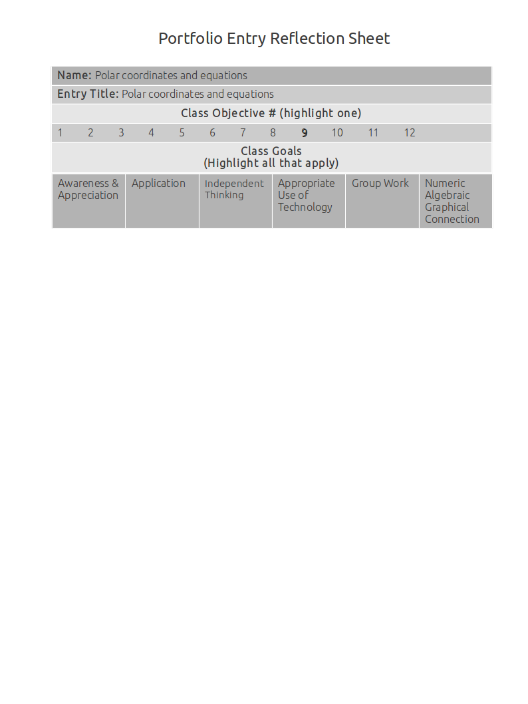

Polar Coordinates And Equations
===============================

How to graph polar coordinates
------------------------------

**Source**: 

**Explanation**: 

This artifact demonstrates how to graph polar coordinates.

**Artifact**:

Converting polar coordinates to rectangular coordinates and rectangular to polar
--------------------------------------------------------------------------------

**Source**: Notes, Section 6.4 example 3A

**Explanation**: 

This artifact demonstrates converting polar coordinates to rectangular coordinates and rectangular to polar.

#. In this example I use the equation :math:`r^2 = x^2 + y^2` to solve for the directed distance (x) and :math:`tan^{-1}({y \over x})` to solve for the directed angle (y).

#. In this example I use the formulas :math:`x = r \cos \theta \text{ and } y = r \sin \theta`, and my knowledge of the unit circle, to calculate the approximate values of x and y.

**Artifact**:

#. Convert the rectangular coordinate (2,7) into a polar coordinate.

:math:`r = \sqrt{2^2 + 7^2} = \sqrt{53}\\
tan^{-1}({7 \over 2}) = 74^\circ`

Polar coordinate = :math:`(\sqrt{53}, 74^\circ)`

#. Convert the polar coordinate :math:`(3, {5\pi \over 6})` into a rectangular coordinate.

:math:`x = r \cos \theta\\
x = 3 \cos {5 \pi \over 6}\\
x = 3(-{\sqrt{3} \over 2}) \approx -2.60`

:math:`y = r \sin\theta\\
y = 3 \sin {5 \pi \over 6}\\
y = 3({1 \over 2}) \approx 1.5`

Rectangular coordinate = :math:`(-2.60, 1.5)`

Converting polar equations to rectangular equations and rectangular to polar
----------------------------------------------------------------------------

**Source**: 

**Explanation**: 

This artifact demonstrates converting polar equations to rectangular equations and rectangular to polar.

**Artifact**:

Graphs of polar equations
-------------------------

**Source**: 

**Explanation**: 

This artifact demonstrates graphs of polar equations.

**Artifact**:

